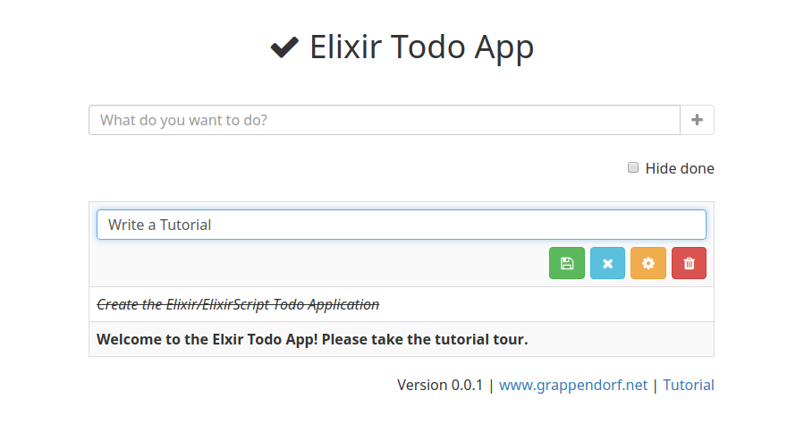

# Elixir Todo App

How to develop a functional user interface for a Todo Web Application with Elixir, ElixirScript, Phoenix, React and Flux
------------------------------------------------------------------------------------------------------------------------

If you love writing your backend services in [Elixir](http://elixir-lang.org), you might ask
yourself "why can't i use Elixir for my frontend development as well?". The good news is:
you can! Although [ElixirScript](https://github.com/elixirscript/elixirscript) is not a finished
product and still has some limitations, [Bryan Joseph](https://github.com/bryanjos) has already 
achieved impressive results in building an Elixir to JavaScript compiler.

This tutorial app shows you how to implement a (more or less) complete Todo Application with Elixir
and ElixirScript and that ElixirScript might become an ideal functional language for frontend 
development, which can bring back the fun into browser development!

To start the Exlir Todo App:

  * Clone the GitHub repository with `git clone https://github.com/grappendorf/elixir_todo_app.git`
  * Install dependencies with `mix deps.get`
  * Install Node.js dependencies with `npm install`
  * Create the database `mix ecto.reset`
  * Start the server with `mix phoenix.server`

Now you can visit [`localhost:4000`](http://localhost:4000) from your browser.
